# Content performance: overall

_Last rebuilt 2026-11-09 11:01 IST from 7 snapshot day(s) and 82 tracked post(s). Start here. Raw data lives in `daily/<date>/`, post traits in `catalog/content.csv`, definitions in [METRICS.md](../METRICS.md)._

## Headline

| Platform | Followers now | Change (first → latest reading) | Posts tracked | Posts with 48h data | Median reach at 48h | Best post (traction) |
|---|---|---|---|---|---|---|
| instagram | 24 | 21 → 24 (+3) | 47 | 37 | 65 | ill-wake-time (96) |
| youtube | 0 | 0 → 0 (+0) | 31 | 9 | 17 | ill-size-problem (74) |
| x | 2 | 2 → 2 (+0) | 4 | 2 | 1 | ill-language-plan (50) |

## Are we improving?

- **instagram**: newer half of posts median reach 128 vs older half 17 → **improving**.
- **youtube**: newer half of posts median reach 11 vs older half 30 → **declining**.
- **x**: only 2 post(s) with 48h data; need 4+ for a trend.

## Charts

### Followers over time (are we growing?)

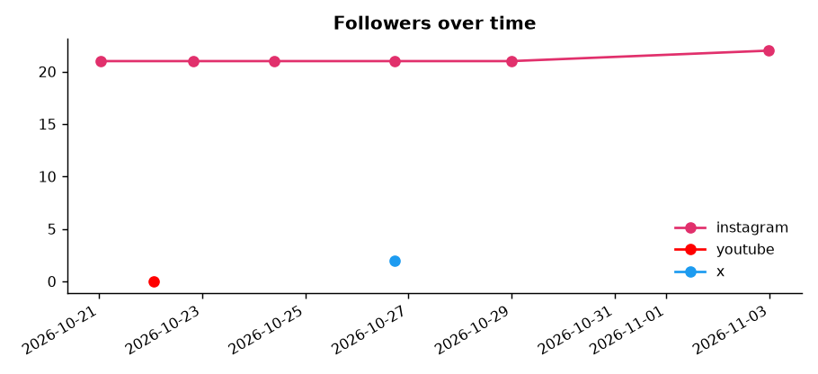

### Instagram: reach at 48h per post, in posting order (bars coloured by style)

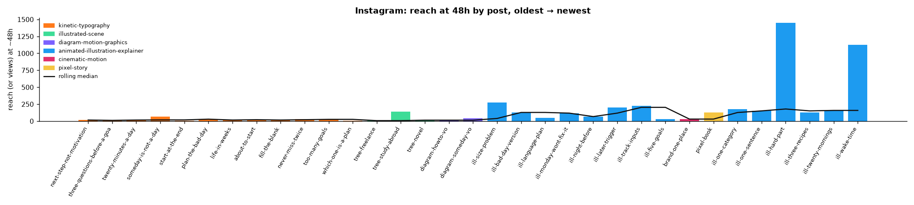

### Youtube: reach at 48h per post, in posting order (bars coloured by style)

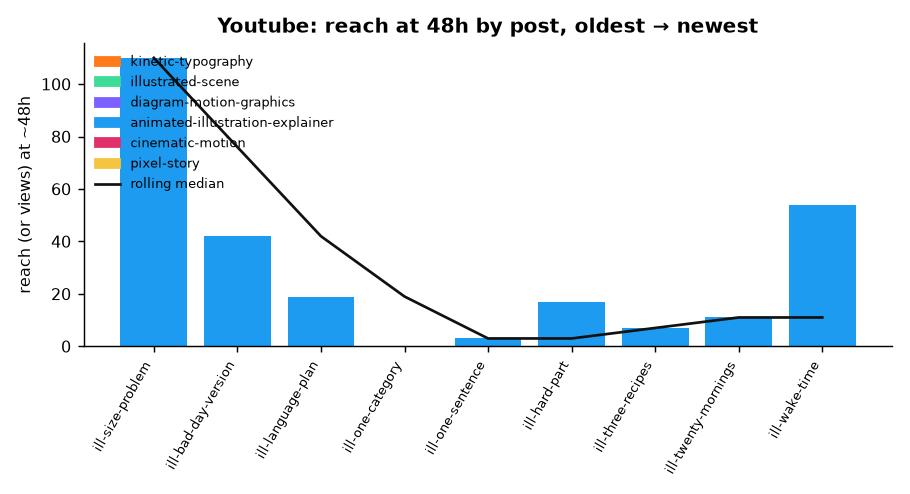

### X: reach at 48h per post, in posting order (bars coloured by style)

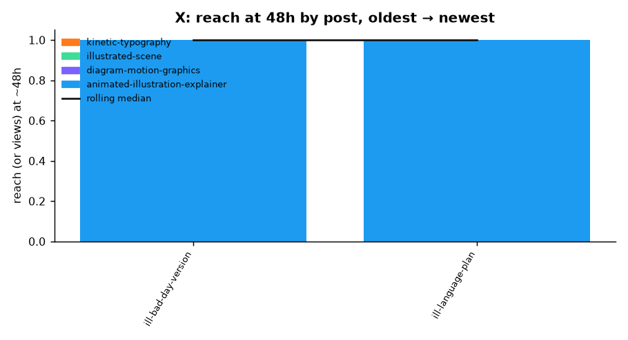

### Total views across tracked posts, per snapshot day

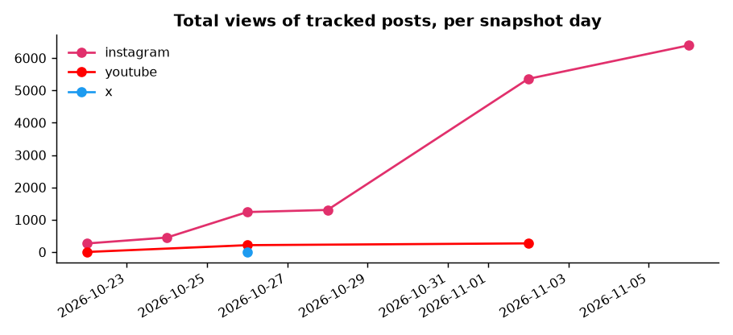

### Instagram: median reach at 48h by style

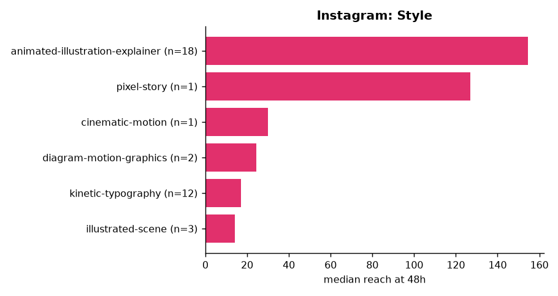

### Instagram: median reach at 48h by hook type

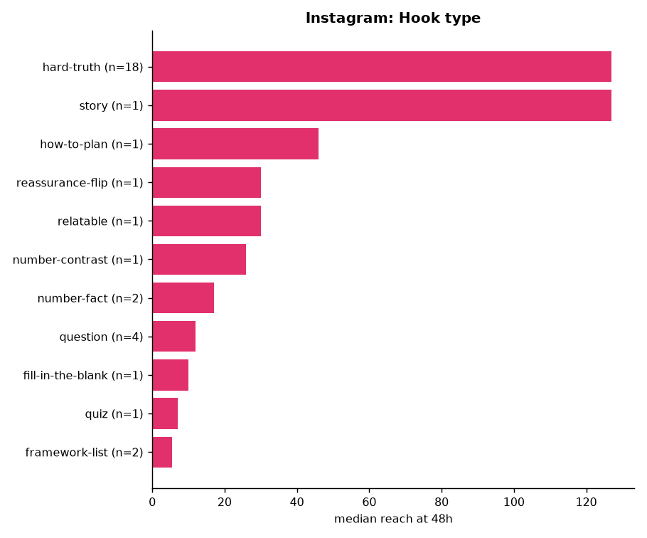

### Youtube: median reach at 48h by hook type

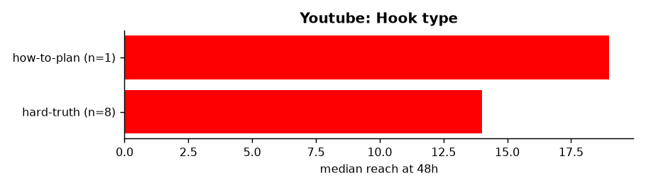

### X: median reach at 48h by hook type

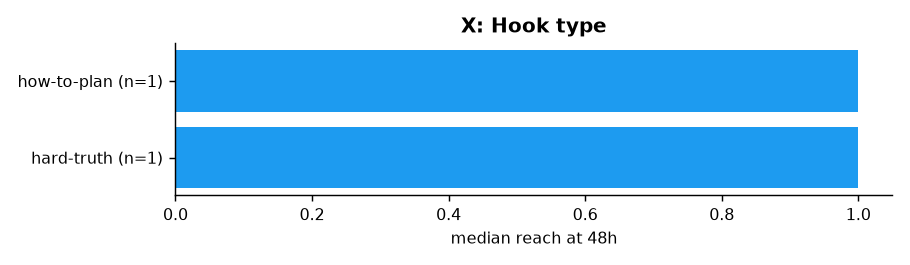

### Instagram: median reach at 48h by topic

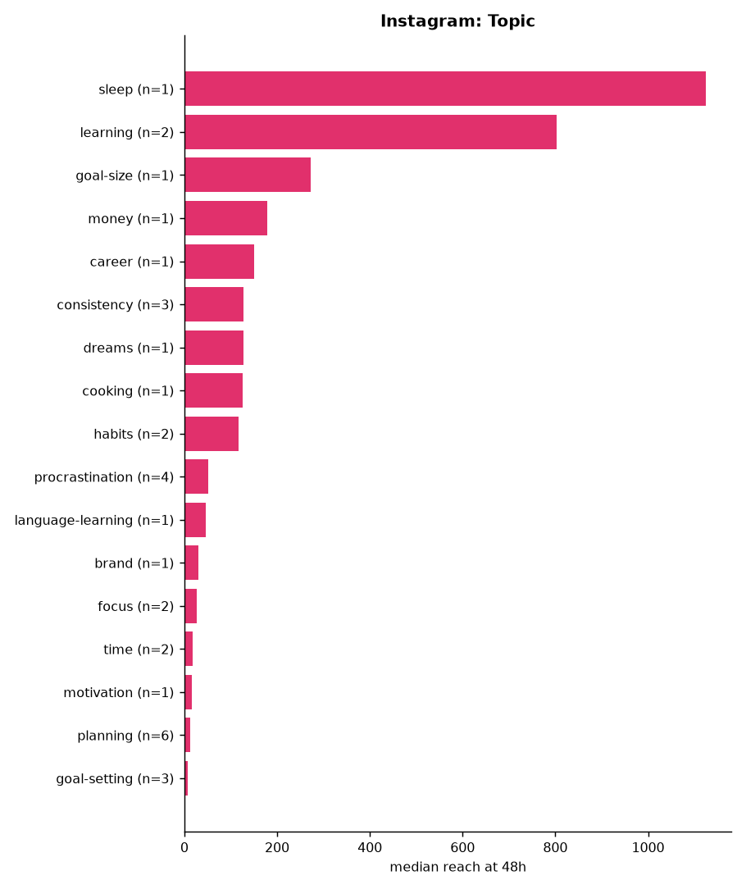

### Youtube: median reach at 48h by topic

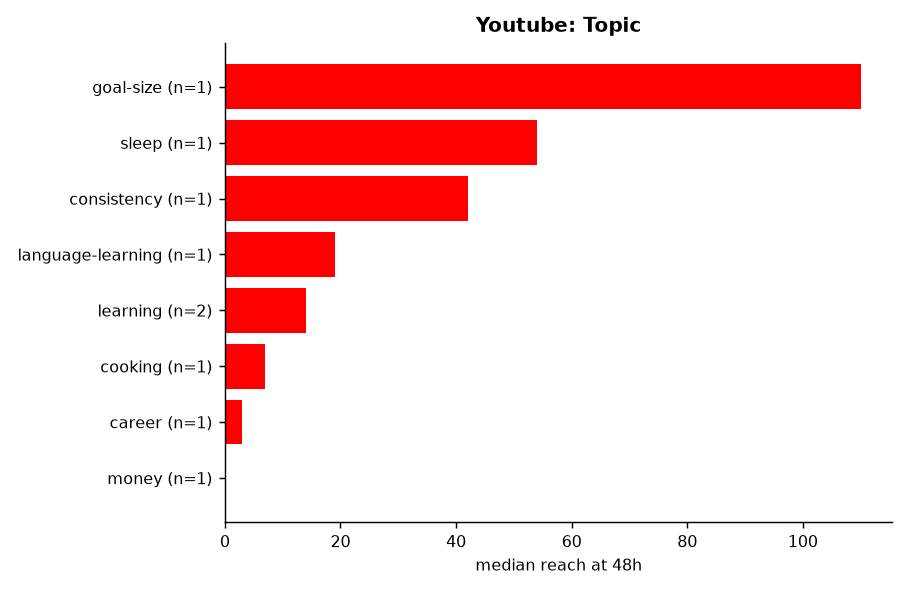

### X: median reach at 48h by topic

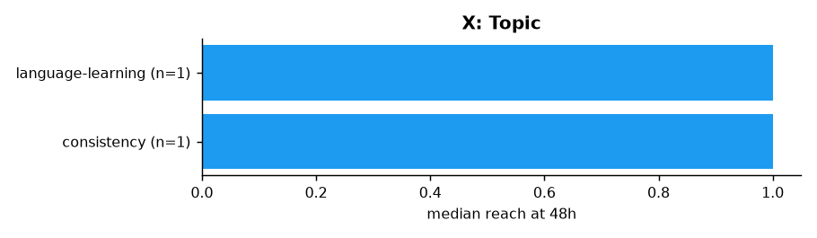

### Instagram: median reach at 48h by posting hour

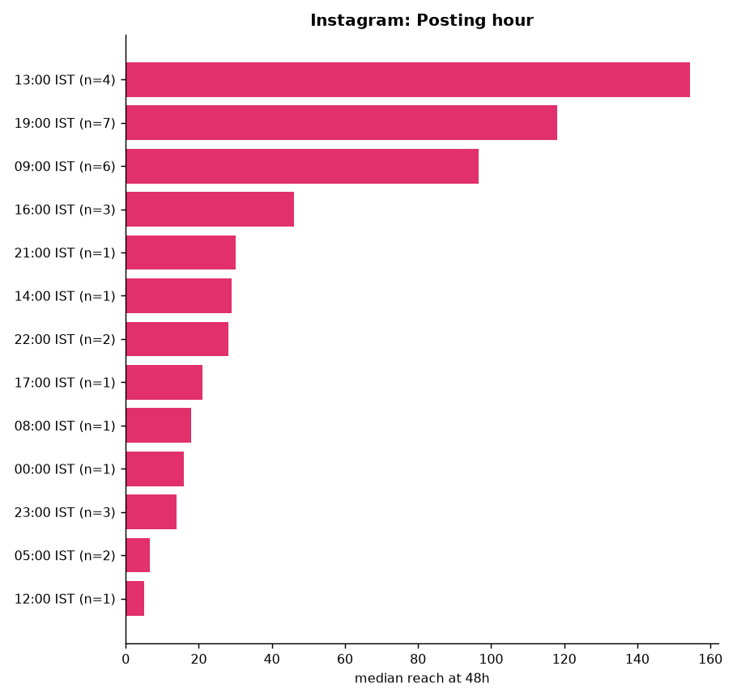

### Youtube: median reach at 48h by posting hour

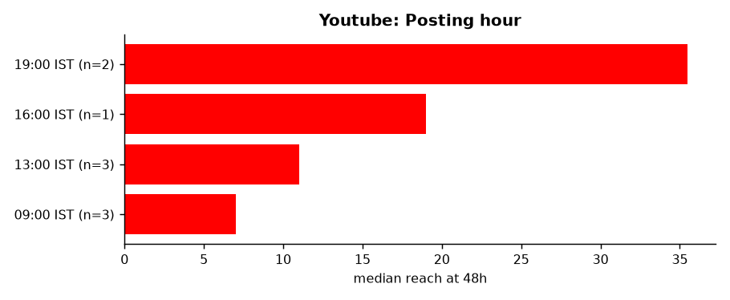

### X: median reach at 48h by posting hour

### Instagram: shares, saves and follows per 1,000 reached

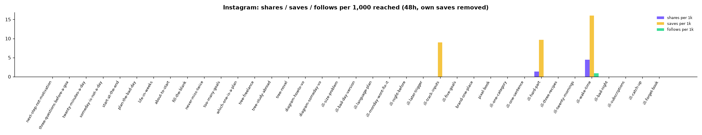

### Youtube: shares, saves and follows per 1,000 reached

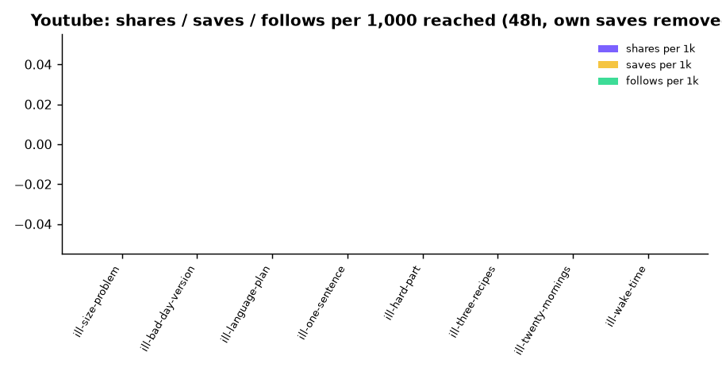

### X: shares, saves and follows per 1,000 reached

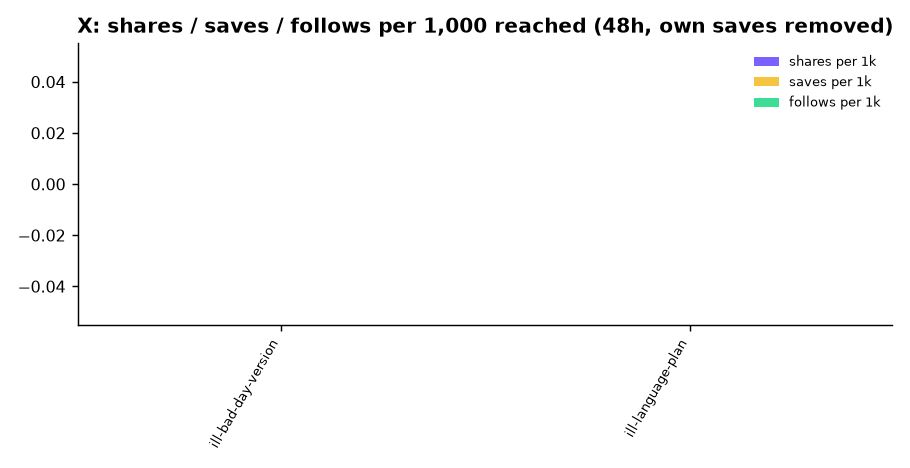

## Leaderboard (48h checkpoint)

### Instagram

| # | Post | Posted (IST) | Style | Hook | Reach 48h | Retention % | Shares+saves /1k | Follows /1k | Traction |
|---|---|---|---|---|---|---|---|---|---|
| 1 | ill-wake-time | 2026-10-31 19:30 | animated-illustration-explainer | hard-truth | 1,124 | – | 20.5 | 0.9 | 96 |
| 2 | ill-hard-part | 2026-10-30 19:30 | animated-illustration-explainer | hard-truth | 1,448 | – | 11.0 | 0.0 | 88 |
| 3 | [ill-track-inputs](https://www.instagram.com/reel/De9IEdqzGDC/) | 2026-10-26 16:30 | animated-illustration-explainer | hard-truth | 223 | – | 9.0 | 0.0 | 80 |
| 4 | ill-bad-night | 2026-11-03 09:30 | animated-illustration-explainer | hard-truth | 1,363 | – | 0.0 | 0.0 | 73 |
| 5 | ill-forget-book | 2026-11-05 20:30 | animated-illustration-explainer | hard-truth | 519 | – | 0.0 | 0.0 | 70 |
| 6 | [ill-size-problem](https://www.instagram.com/reel/De5zI6YTeeV/) | 2026-10-25 09:30 | animated-illustration-explainer | hard-truth | 272 | – | 0.0 | 0.0 | 69 |
| 7 | [ill-later-trigger](https://www.instagram.com/reel/De8v_dwzUDu/) | 2026-10-26 13:00 | animated-illustration-explainer | hard-truth | 203 | – | 0.0 | 0.0 | 66 |
| 8 | ill-one-category | 2026-10-30 09:30 | animated-illustration-explainer | hard-truth | 179 | – | 0.0 | 0.0 | 65 |
| 9 | ill-twenty-mornings | 2026-10-31 13:00 | animated-illustration-explainer | hard-truth | 158 | – | 0.0 | 0.0 | 63 |
| 10 | ill-one-sentence | 2026-10-30 13:00 | animated-illustration-explainer | hard-truth | 151 | – | 0.0 | 0.0 | 62 |
| 11 | [tree-study-abroad](https://www.instagram.com/reel/DezJblYzfye/) | 2026-10-22 19:30 | illustrated-scene | question | 141 | – | 0.0 | 0.0 | 60 |
| 12 | [ill-bad-day-version](https://www.instagram.com/reel/De6LNpMTDf7/) | 2026-10-25 13:00 | animated-illustration-explainer | hard-truth | 128 | – | 0.0 | 0.0 | 59 |
| 13 | pixel-book | 2026-10-27 23:55 | pixel-story | story | 127 | – | 0.0 | 0.0 | 57 |
| 14 | ill-three-recipes | 2026-10-31 09:30 | animated-illustration-explainer | hard-truth | 126 | – | 0.0 | 0.0 | 56 |
| 15 | [ill-monday-wont-fix-it](https://www.instagram.com/reel/De633j1TDG9/) | 2026-10-25 19:30 | animated-illustration-explainer | hard-truth | 118 | – | 0.0 | 0.0 | 54 |
| 16 | ill-catch-up | 2026-11-03 19:30 | animated-illustration-explainer | story | 113 | – | 0.0 | 0.0 | 53 |
| 17 | ill-subscriptions | 2026-11-03 13:00 | animated-illustration-explainer | hard-truth | 80 | – | 0.0 | 0.0 | 52 |
| 18 | [ill-night-before](https://www.instagram.com/reel/De8X8KzzMBa/) | 2026-10-26 09:30 | animated-illustration-explainer | hard-truth | 67 | – | 0.0 | 0.0 | 50 |
| 19 | [someday-is-not-a-day](https://www.instagram.com/reel/Devf-yOz9AS/) | 2026-10-21 09:30 | kinetic-typography | hard-truth | 65 | – | 0.0 | 0.0 | 49 |
| 20 | [ill-language-plan](https://www.instagram.com/reel/De6jQagTCom/) | 2026-10-25 16:30 | animated-illustration-explainer | how-to-plan | 46 | – | 0.0 | 0.0 | 47 |
| 21 | [diagram-someday-vo](https://www.instagram.com/reel/De1uUEGzH1P/) | 2026-10-23 19:30 | diagram-motion-graphics | hard-truth | 39 | – | 0.0 | 0.0 | 46 |
| 22 | [never-miss-twice](https://www.instagram.com/reel/DewyWMxzwg1/) | 2026-10-21 21:30 | kinetic-typography | reassurance-flip | 30 | – | 0.0 | 0.0 | 44 |
| 23 | brand-one-place | 2026-10-26 22:00 | cinematic-motion | relatable | 30 | – | 0.0 | 0.0 | 44 |
| 24 | [plan-the-bad-day](https://www.instagram.com/reel/DewCV5ATeLJ/) | 2026-10-21 14:30 | kinetic-typography | hard-truth | 29 | – | 0.0 | 0.0 | 41 |
| 25 | ill-five-goals | 2026-10-26 19:30 | animated-illustration-explainer | hard-truth | 27 | – | 0.0 | 0.0 | 40 |
| 26 | [too-many-goals](https://www.instagram.com/reel/Dew5OYwTJZK/) | 2026-10-21 22:30 | kinetic-typography | number-contrast | 26 | – | 0.0 | 0.0 | 39 |
| 27 | [about-to-start](https://www.instagram.com/reel/DewW-D0TzPm/) | 2026-10-21 17:30 | kinetic-typography | hard-truth | 21 | – | 0.0 | 0.0 | 37 |
| 28 | [twenty-minutes-a-day](https://www.instagram.com/reel/DevZFYvz8iS/) | 2026-10-21 08:30 | kinetic-typography | number-fact | 18 | – | 0.0 | 0.0 | 36 |
| 29 | [next-step-not-motivation](https://www.instagram.com/reel/DeulBhStyuO/) | 2026-10-21 00:54 | kinetic-typography | hard-truth | 16 | – | 0.0 | 0.0 | 34 |
| 30 | [life-in-weeks](https://www.instagram.com/reel/DewQFg0TZfs/) | 2026-10-21 16:30 | kinetic-typography | number-fact | 16 | – | 0.0 | 0.0 | 34 |
| 31 | [tree-novel](https://www.instagram.com/reel/Dezk97kTy37/) | 2026-10-22 23:30 | illustrated-scene | question | 14 | – | 0.0 | 0.0 | 31 |
| 32 | [fill-the-blank](https://www.instagram.com/reel/Dewkt5bTJJ1/) | 2026-10-21 19:30 | kinetic-typography | fill-in-the-blank | 10 | – | 0.0 | 0.0 | 29 |
| 33 | [diagram-howto-vo](https://www.instagram.com/reel/De0pmqQTJ3O/) | 2026-10-23 09:30 | diagram-motion-graphics | question | 10 | – | 0.0 | 0.0 | 29 |
| 34 | [which-one-is-a-plan](https://www.instagram.com/reel/DexAG3sTNN-/) | 2026-10-21 23:30 | kinetic-typography | quiz | 7 | – | 0.0 | 0.0 | 26 |
| 35 | [tree-freelance](https://www.instagram.com/reel/DexpYG0zBz4/) | 2026-10-22 05:30 | illustrated-scene | question | 7 | – | 0.0 | 0.0 | 26 |
| 36 | [three-questions-before-a-goal](https://www.instagram.com/reel/DevEkV9T33l/) | 2026-10-21 05:30 | kinetic-typography | framework-list | 6 | – | 0.0 | 0.0 | 24 |
| 37 | [start-at-the-end](https://www.instagram.com/reel/Dev0ly8T2f8/) | 2026-10-21 12:30 | kinetic-typography | framework-list | 5 | – | 0.0 | 0.0 | 23 |

### Youtube

| # | Post | Posted (IST) | Style | Hook | Reach 48h | Retention % | Shares+saves /1k | Follows /1k | Traction |
|---|---|---|---|---|---|---|---|---|---|
| 1 | [ill-size-problem](https://youtube.com/shorts/U8PvH17xm-k) | 2026-10-25 09:30 | animated-illustration-explainer | hard-truth | 110 | – | 0.0 | 0.0 | 74 |
| 2 | ill-wake-time | 2026-10-31 19:30 | animated-illustration-explainer | hard-truth | 54 | – | 0.0 | 0.0 | 68 |
| 3 | [ill-bad-day-version](https://youtube.com/shorts/g1Ri7WMhaG4) | 2026-10-25 13:00 | animated-illustration-explainer | hard-truth | 42 | – | 0.0 | 0.0 | 62 |
| 4 | ill-language-plan | 2026-10-25 16:30 | animated-illustration-explainer | how-to-plan | 19 | – | 0.0 | 0.0 | 56 |
| 5 | ill-hard-part | 2026-10-30 19:30 | animated-illustration-explainer | hard-truth | 17 | – | 0.0 | 0.0 | 50 |
| 6 | ill-twenty-mornings | 2026-10-31 13:00 | animated-illustration-explainer | hard-truth | 11 | – | 0.0 | 0.0 | 44 |
| 7 | ill-three-recipes | 2026-10-31 09:30 | animated-illustration-explainer | hard-truth | 7 | – | 0.0 | 0.0 | 38 |
| 8 | ill-one-sentence | 2026-10-30 13:00 | animated-illustration-explainer | hard-truth | 3 | – | 0.0 | 0.0 | 32 |
| 9 | ill-one-category | 2026-10-30 09:30 | animated-illustration-explainer | hard-truth | 0 | – | 0.0 | – | 20 |

### X

| # | Post | Posted (IST) | Style | Hook | Reach 48h | Retention % | Shares+saves /1k | Follows /1k | Traction |
|---|---|---|---|---|---|---|---|---|---|
| 1 | ill-language-plan | 2026-10-25 16:30 | animated-illustration-explainer | how-to-plan | 1 | – | 0.0 | 0.0 | 50 |
| 2 | ill-bad-day-version | 2026-10-25 13:00 | animated-illustration-explainer | hard-truth | 1 | – | 0.0 | 0.0 | 50 |

## Too early to judge (no 48h reading yet)

| Post | Platform | Posted (IST) | Latest age (h) | Latest views |
|---|---|---|---|---|
| next-step-not-motivation | youtube | 2026-10-21 23:45 | 114 | 8 |
| three-questions-before-a-goal | youtube | 2026-10-21 23:52 | 114 | 8 |
| twenty-minutes-a-day | youtube | 2026-10-22 00:00 | 114 | 15 |
| someday-is-not-a-day | youtube | 2026-10-22 00:20 | 113 | 0 |
| start-at-the-end | youtube | 2026-10-22 00:30 | 113 | 0 |
| plan-the-bad-day | youtube | 2026-10-22 00:38 | 113 | 0 |
| life-in-weeks | youtube | 2026-10-22 00:46 | 113 | 1 |
| about-to-start | youtube | 2026-10-22 00:54 | 113 | 0 |
| fill-the-blank | youtube | 2026-10-22 01:02 | 112 | 0 |
| never-miss-twice | youtube | 2026-10-22 01:10 | 112 | 0 |
| ill-monday-wont-fix-it | youtube | 2026-10-25 19:30 | 22 | 0 |
| ill-monday-wont-fix-it | x | 2026-10-25 19:30 | 22 | 1 |
| ill-night-before | youtube | 2026-10-26 09:30 | 8 | 5 |
| ill-night-before | x | 2026-10-26 09:30 | 8 | 1 |
| ill-later-trigger | youtube | 2026-10-26 13:00 | 4 | 5 |
| ill-track-inputs | youtube | 2026-10-26 16:30 | 1 | 0 |
| pixel-book | youtube | 2026-10-27 23:55 | 144 | 126 |
| ill-save-first | instagram | 2026-10-28 09:30 | 134 | 40 |
| ill-save-first | youtube | 2026-10-28 09:30 | 134 | 0 |
| ill-career-conversations | instagram | 2026-10-28 13:00 | 131 | 82 |
| ill-career-conversations | youtube | 2026-10-28 13:00 | 131 | 5 |
| ill-goal-date | instagram | 2026-10-28 16:30 | 127 | 13 |
| ill-goal-date | youtube | 2026-10-28 16:30 | 127 | 7 |
| ill-phone-distance | instagram | 2026-10-28 19:30 | 124 | 112 |
| ill-phone-distance | youtube | 2026-10-28 19:30 | 124 | 0 |
| ill-unclear-task | instagram | 2026-10-29 09:30 | 204 | 47 |
| ill-unclear-task | youtube | 2026-10-29 09:30 | 110 | 11 |
| ill-ten-pages | instagram | 2026-10-29 13:00 | 201 | 106 |
| ill-ten-pages | youtube | 2026-10-29 13:00 | 107 | 22 |
| ill-gym-day-four | instagram | 2026-10-29 19:30 | 194 | 187 |
| ill-gym-day-four | youtube | 2026-10-29 19:30 | 100 | 5 |
| ill-caffeine | instagram | 2026-11-05 22:00 | 24 | 169 |
| ill-dark-morning | instagram | 2026-11-06 09:30 | 12 | 193 |
| ill-say-sentences | instagram | 2026-11-06 20:20 | – | 104 |

## Data gaps

- 48 post(s) have no retention (watch time) data: Instagram web insights do not show it; get app screenshots.
- In catalog but never measured: x:diagram-howto-vo, x:diagram-someday-vo, x:ill-size-problem, x:ill-later-trigger, x:ill-track-inputs, x:ill-five-goals, youtube:ill-five-goals, x:brand-one-place, youtube:brand-one-place, x:pixel-book, x:ill-save-first, x:ill-career-conversations, x:ill-goal-date, x:ill-phone-distance, x:ill-unclear-task, x:ill-ten-pages, x:ill-gym-day-four, x:ill-one-category, x:ill-one-sentence, x:ill-hard-part, x:ill-three-recipes, x:ill-twenty-mornings, x:ill-wake-time, x:ill-bad-night, youtube:ill-bad-night, x:ill-subscriptions, youtube:ill-subscriptions, x:ill-catch-up, youtube:ill-catch-up, x:ill-busy-week, x:ill-pickups, x:ill-caffeine, youtube:ill-busy-week, youtube:ill-pickups, youtube:ill-caffeine, x:ill-dark-morning, youtube:ill-dark-morning, x:ill-say-sentences, youtube:ill-say-sentences, x:ill-forget-book, youtube:ill-forget-book, instagram:ill-miss-twice, x:ill-miss-twice, youtube:ill-miss-twice, instagram:ill-pickups, instagram:ill-ten-minute-reset, x:ill-ten-minute-reset, youtube:ill-ten-minute-reset, instagram:ill-same-weight, x:ill-same-weight, youtube:ill-same-weight, instagram:ill-first-ten-minutes, x:ill-first-ten-minutes, instagram:pixel-kabir-1, x:pixel-kabir-1, instagram:ill-decide-once, x:ill-decide-once.

See [WHAT_WORKED.md](WHAT_WORKED.md) for trait-by-trait comparisons and [latest_by_post.csv](latest_by_post.csv) for every number in one table.

